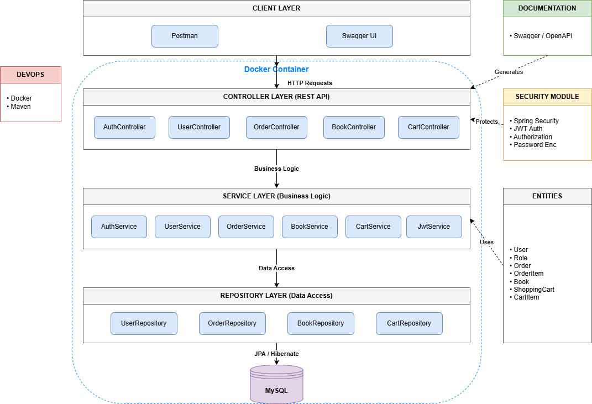

# Spring Boot REST API

A modern RESTful backend application built with Java and Spring Boot.  
This project demonstrates how to create a secure, scalable, and production-ready API using the Spring ecosystem and best backend development practices.

The main goal of this project was to deepen my understanding of enterprise Java development, REST architecture, authentication/authorization, database interaction, and clean backend structure. While building it, I focused not only on functionality, but also on maintainability, security, and real-world backend patterns.

---

## 🚀 Features

- RESTful API architecture
- Authentication & authorization
- Role-based access control
- CRUD operations
- DTO mapping
- Validation handling
- Exception handling
- Swagger/OpenAPI documentation
- Database integration with JPA/Hibernate
- Layered architecture (Controller → Service → Repository)
- Integration and unit testing

---

## 🛠️ Technologies Used

### Backend
- Java 17+
- Spring Boot
- Spring Web
- Spring Security
- Spring Data JPA
- Hibernate
- Maven

### Database
- MySQL

### Documentation & Tools
- Swagger / OpenAPI
- Lombok
- Postman
- Git & GitHub

### Testing
- JUnit 5
- Mockito
- MockMvc

---

## 📂 Project Structure

```text
src
 ┣ main
 ┃ ┣ java
 ┃ ┃ ┗ com.example.springboot
 ┃ ┃    ┣ controller
 ┃ ┃    ┣ service
 ┃ ┃    ┣ repository
 ┃ ┃    ┣ entity
 ┃ ┃    ┣ dto
 ┃ ┃    ┣ security
 ┃ ┃    ┗ exception
 ┃ ┗ resources
 ┃    ┣ application.properties
 ┃    ┗ static
 ┗ test
```

---

# 🏗️ Project Architecture



---

## 🔐 Security

This project uses **Spring Security** to secure API endpoints and manage authentication/authorization.

Implemented security features include:

- Password encryption
- Authentication filters
- Role-based authorization
- Protected API endpoints
- Custom authentication handling

---

## 📖 API Documentation

Swagger UI is integrated into the project for easier API testing and exploration.

After starting the application, open:

```bash
http://localhost:8080/swagger-ui/index.html
```

---

## ⚙️ Getting Started

### 1. Clone the repository

```bash
git clone https://github.com/noleynik29/spring-boot.git
```

```bash
cd spring-boot
```

---

### 2. Configure the database

Open:

```bash
src/main/resources/application.properties
```

Configure your database connection:

```properties
spring.datasource.url=jdbc:mysql://localhost:3306/your_database
spring.datasource.username=your_username
spring.datasource.password=your_password

spring.jpa.hibernate.ddl-auto=update
```

---

### 3. Build the project

Using Maven:

```bash
mvn clean install
```

---

### 4. Run the application

```bash
mvn spring-boot:run
```

Or run the generated JAR:

```bash
java -jar target/spring-boot.jar
```

---

# 🐳 Running with Docker

## 1. Build the project

Before building the Docker image, generate the JAR file:

```bash
mvn clean package
```

---

## 2. Build Docker image

```bash
docker build -t spring-boot-app .
```

---

## 3. Run Docker container

```bash
docker run -p 8080:8080 spring-boot-app
```

The application will be available at:

```bash
http://localhost:8080
```

---

## 4. Stop container

List running containers:

```bash
docker ps
```

Stop container:

```bash
docker stop <container_id>
```

---

## 5. Swagger API Documentation

After starting the container, Swagger UI will be available at:

```bash
http://localhost:8080/swagger-ui/index.html
```

## 🧪 Running Tests

Run all tests with:

```bash
mvn test
```

The project contains:
- Unit tests
- Integration tests
- Controller tests using MockMvc

---

# 📬 Postman Collection

This project includes a ready-to-use Postman collection for testing all API endpoints.

## 📥 How to use

1. Download or clone the repository
2. Open Postman
3. Click **Import**
4. Select file:
   ```
   /postman/postman-collection-import.json
   ```
5. Import it
6. Run the application locally
7. Start testing endpoints

## 🔐 Authentication

This project uses JWT authentication.

After login, copy the token and set it in Postman Environment:

```text
token = your_jwt_token_here
```

Then all secured requests will automatically use:

```text
Authorization: Bearer {{token}}
```

## 🚀 Example workflow

1. Register user
2. Login
3. Save JWT token
4. Use Books / Orders endpoints

## 🧩 Challenges & Lessons Learned

While developing this project, I encountered several real-world backend development challenges, including:

- Handling authentication and authorization correctly
- Structuring large Spring Boot applications
- Managing DTO mapping and entity relationships
- Fixing `LazyInitializationException`
- Writing stable integration tests
- Improving exception handling
- Securing REST endpoints properly

These challenges helped me better understand how enterprise backend applications are designed and maintained.

---

## 📸 Possible Improvements

Future improvements may include:

- Docker support
- CI/CD pipeline
- Redis caching
- OAuth2 authentication
- Email verification
- Refresh tokens
- Kubernetes deployment
- Microservices architecture

---

## 💡 What I Learned

This project significantly improved my understanding of:

- REST API development
- Spring ecosystem
- Clean code principles
- Backend architecture
- Testing strategies
- Security best practices
- Database design

---

## 🤝 Contributing

Contributions, issues, and feature requests are welcome.

Feel free to fork the project and submit a pull request.

---

## 📄 License

This project is licensed under the MIT License.

---

## ⭐ Repository

https://github.com/noleynik29/spring-boot
